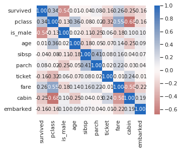
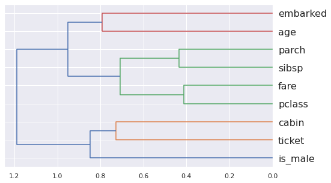
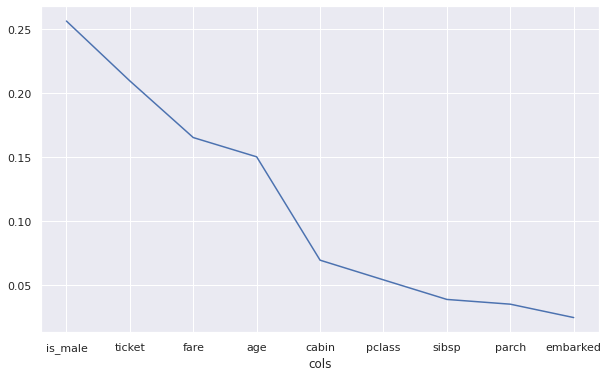
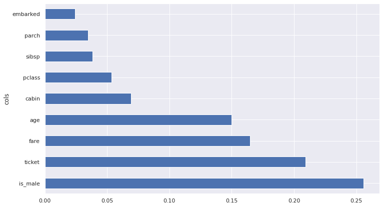
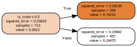
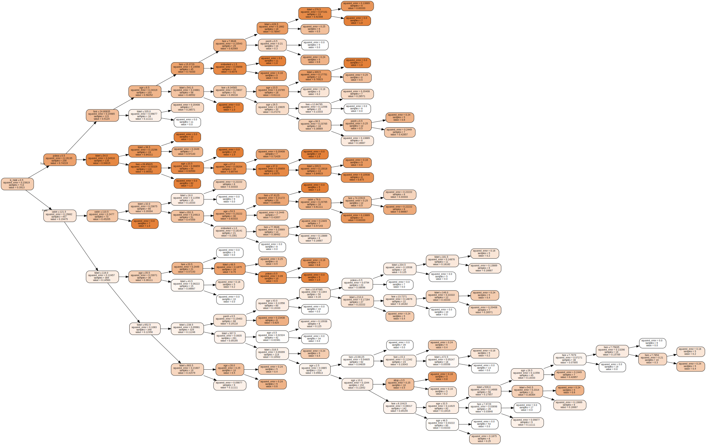
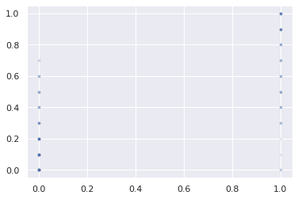
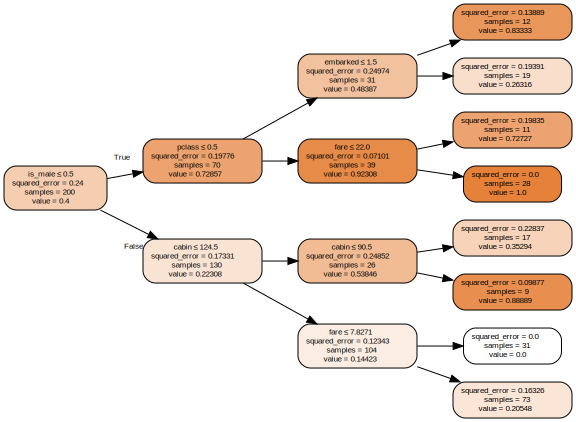
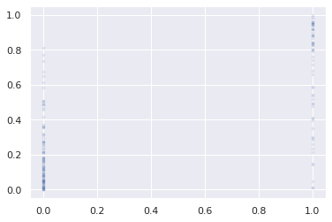

```python
import json, re, sys

import matplotlib.pyplot as plt, seaborn as sb
import math
import numpy as np, pandas as pd
#import requests
import graphviz # conda install python-graphviz

import scipy
from scipy.cluster import hierarchy as hc

from IPython.display import clear_output

from sklearn import tree, metrics
from sklearn.ensemble import RandomForestRegressor, RandomForestClassifier

import warnings

sb.set(rc={"figure.dpi": 78, "savefig.dpi": 78, "figure.figsize":(10,6)})
sb.set(rc={})
sb.set_context("notebook")
sb.set_style("ticks")
sb.set_style("darkgrid")  # Make it pretty!
base_color = sb.color_palette()[0]

# Ensure we see all columns, and the contents of each!
#pd.set_option("display.max_colwidth", None)
#pd.set_option("display.max_columns", None)

np.set_printoptions(linewidth=130)

%matplotlib inline
# %config InlineBackend.figure_format = 'retina' # Increase resolution of plots. Seems to conflict with seaborn settings above

# automatically reloads imports
%load_ext autoreload
%autoreload 2

DATA_PATH = 'data/'

print(f"sys.version: {sys.version}")
print(f"pd.__version__: {pd.__version__}")
```

    sys.version: 3.10.4 (main, Mar 31 2022, 08:41:55) [GCC 7.5.0]
    pd.__version__: 1.4.3


```python
!pwd
```

    /home/rdzg/Seafile/Learning/kaggle/titanic_1


```python
!ls {DATA_PATH}
```

    gender_submission.csv  test.csv  train.csv


```python
!head -n 1 {DATA_PATH}train.csv
```

    PassengerId,Survived,Pclass,Name,Sex,Age,SibSp,Parch,Ticket,Fare,Cabin,Embarked


```python
!shuf -n 3 {DATA_PATH}train.csv
```

    458,1,1,"Kenyon, Mrs. Frederick R (Marion)",female,,1,0,17464,51.8625,D21,S
    376,1,1,"Meyer, Mrs. Edgar Joseph (Leila Saks)",female,,1,0,PC 17604,82.1708,,C
    462,0,3,"Morley, Mr. William",male,34,0,0,364506,8.05,,S


Steps to take:

1. EDA
1. Split the given training data set into Training and Validation sets. Decide on a proportion: 20% of rows for Validation?
1. Drop the 'Survived' col from the Validation set
1. Copy the 'Survived' col from the new Training set to a new 1d array 'y'
1. Dropping the 'Survived' col, copy the Training set to a new 2d array 'X'


```python
df_raw = pd.read_csv(DATA_PATH + 'train.csv', low_memory = False)
```


```python
df_raw.head()
```


<div>
<style scoped>
    .dataframe tbody tr th:only-of-type {
        vertical-align: middle;
    }

    .dataframe tbody tr th {
        vertical-align: top;
    }

    .dataframe thead th {
        text-align: right;
    }
</style>
<table border="1" class="dataframe">
  <thead>
    <tr style="text-align: right;">
      <th></th>
      <th>PassengerId</th>
      <th>Survived</th>
      <th>Pclass</th>
      <th>Name</th>
      <th>Sex</th>
      <th>Age</th>
      <th>SibSp</th>
      <th>Parch</th>
      <th>Ticket</th>
      <th>Fare</th>
      <th>Cabin</th>
      <th>Embarked</th>
    </tr>
  </thead>
  <tbody>
    <tr>
      <th>0</th>
      <td>1</td>
      <td>0</td>
      <td>3</td>
      <td>Braund, Mr. Owen Harris</td>
      <td>male</td>
      <td>22.0</td>
      <td>1</td>
      <td>0</td>
      <td>A/5 21171</td>
      <td>7.2500</td>
      <td>NaN</td>
      <td>S</td>
    </tr>
    <tr>
      <th>1</th>
      <td>2</td>
      <td>1</td>
      <td>1</td>
      <td>Cumings, Mrs. John Bradley (Florence Briggs Th...</td>
      <td>female</td>
      <td>38.0</td>
      <td>1</td>
      <td>0</td>
      <td>PC 17599</td>
      <td>71.2833</td>
      <td>C85</td>
      <td>C</td>
    </tr>
    <tr>
      <th>2</th>
      <td>3</td>
      <td>1</td>
      <td>3</td>
      <td>Heikkinen, Miss. Laina</td>
      <td>female</td>
      <td>26.0</td>
      <td>0</td>
      <td>0</td>
      <td>STON/O2. 3101282</td>
      <td>7.9250</td>
      <td>NaN</td>
      <td>S</td>
    </tr>
    <tr>
      <th>3</th>
      <td>4</td>
      <td>1</td>
      <td>1</td>
      <td>Futrelle, Mrs. Jacques Heath (Lily May Peel)</td>
      <td>female</td>
      <td>35.0</td>
      <td>1</td>
      <td>0</td>
      <td>113803</td>
      <td>53.1000</td>
      <td>C123</td>
      <td>S</td>
    </tr>
    <tr>
      <th>4</th>
      <td>5</td>
      <td>0</td>
      <td>3</td>
      <td>Allen, Mr. William Henry</td>
      <td>male</td>
      <td>35.0</td>
      <td>0</td>
      <td>0</td>
      <td>373450</td>
      <td>8.0500</td>
      <td>NaN</td>
      <td>S</td>
    </tr>
  </tbody>
</table>
</div>


```python
df_raw = df_raw.set_index('PassengerId')
```


```python
df_raw.columns = df_raw.columns.str.lower()
```


```python
#df_raw['survived'] = df_raw['survived'].astype('bool')
```


```python
m = df_raw['age'].isna()
df_raw[m]
```


<div>
<style scoped>
    .dataframe tbody tr th:only-of-type {
        vertical-align: middle;
    }

    .dataframe tbody tr th {
        vertical-align: top;
    }

    .dataframe thead th {
        text-align: right;
    }
</style>
<table border="1" class="dataframe">
  <thead>
    <tr style="text-align: right;">
      <th></th>
      <th>survived</th>
      <th>pclass</th>
      <th>name</th>
      <th>sex</th>
      <th>age</th>
      <th>sibsp</th>
      <th>parch</th>
      <th>ticket</th>
      <th>fare</th>
      <th>cabin</th>
      <th>embarked</th>
    </tr>
    <tr>
      <th>PassengerId</th>
      <th></th>
      <th></th>
      <th></th>
      <th></th>
      <th></th>
      <th></th>
      <th></th>
      <th></th>
      <th></th>
      <th></th>
      <th></th>
    </tr>
  </thead>
  <tbody>
    <tr>
      <th>6</th>
      <td>0</td>
      <td>3</td>
      <td>Moran, Mr. James</td>
      <td>male</td>
      <td>NaN</td>
      <td>0</td>
      <td>0</td>
      <td>330877</td>
      <td>8.4583</td>
      <td>NaN</td>
      <td>Q</td>
    </tr>
    <tr>
      <th>18</th>
      <td>1</td>
      <td>2</td>
      <td>Williams, Mr. Charles Eugene</td>
      <td>male</td>
      <td>NaN</td>
      <td>0</td>
      <td>0</td>
      <td>244373</td>
      <td>13.0000</td>
      <td>NaN</td>
      <td>S</td>
    </tr>
    <tr>
      <th>20</th>
      <td>1</td>
      <td>3</td>
      <td>Masselmani, Mrs. Fatima</td>
      <td>female</td>
      <td>NaN</td>
      <td>0</td>
      <td>0</td>
      <td>2649</td>
      <td>7.2250</td>
      <td>NaN</td>
      <td>C</td>
    </tr>
    <tr>
      <th>27</th>
      <td>0</td>
      <td>3</td>
      <td>Emir, Mr. Farred Chehab</td>
      <td>male</td>
      <td>NaN</td>
      <td>0</td>
      <td>0</td>
      <td>2631</td>
      <td>7.2250</td>
      <td>NaN</td>
      <td>C</td>
    </tr>
    <tr>
      <th>29</th>
      <td>1</td>
      <td>3</td>
      <td>O'Dwyer, Miss. Ellen "Nellie"</td>
      <td>female</td>
      <td>NaN</td>
      <td>0</td>
      <td>0</td>
      <td>330959</td>
      <td>7.8792</td>
      <td>NaN</td>
      <td>Q</td>
    </tr>
    <tr>
      <th>...</th>
      <td>...</td>
      <td>...</td>
      <td>...</td>
      <td>...</td>
      <td>...</td>
      <td>...</td>
      <td>...</td>
      <td>...</td>
      <td>...</td>
      <td>...</td>
      <td>...</td>
    </tr>
    <tr>
      <th>860</th>
      <td>0</td>
      <td>3</td>
      <td>Razi, Mr. Raihed</td>
      <td>male</td>
      <td>NaN</td>
      <td>0</td>
      <td>0</td>
      <td>2629</td>
      <td>7.2292</td>
      <td>NaN</td>
      <td>C</td>
    </tr>
    <tr>
      <th>864</th>
      <td>0</td>
      <td>3</td>
      <td>Sage, Miss. Dorothy Edith "Dolly"</td>
      <td>female</td>
      <td>NaN</td>
      <td>8</td>
      <td>2</td>
      <td>CA. 2343</td>
      <td>69.5500</td>
      <td>NaN</td>
      <td>S</td>
    </tr>
    <tr>
      <th>869</th>
      <td>0</td>
      <td>3</td>
      <td>van Melkebeke, Mr. Philemon</td>
      <td>male</td>
      <td>NaN</td>
      <td>0</td>
      <td>0</td>
      <td>345777</td>
      <td>9.5000</td>
      <td>NaN</td>
      <td>S</td>
    </tr>
    <tr>
      <th>879</th>
      <td>0</td>
      <td>3</td>
      <td>Laleff, Mr. Kristo</td>
      <td>male</td>
      <td>NaN</td>
      <td>0</td>
      <td>0</td>
      <td>349217</td>
      <td>7.8958</td>
      <td>NaN</td>
      <td>S</td>
    </tr>
    <tr>
      <th>889</th>
      <td>0</td>
      <td>3</td>
      <td>Johnston, Miss. Catherine Helen "Carrie"</td>
      <td>female</td>
      <td>NaN</td>
      <td>1</td>
      <td>2</td>
      <td>W./C. 6607</td>
      <td>23.4500</td>
      <td>NaN</td>
      <td>S</td>
    </tr>
  </tbody>
</table>
<p>177 rows × 11 columns</p>
</div>


## Initial cleaning of `df_raw`


```python
df_raw.info()
```

    <class 'pandas.core.frame.DataFrame'>
    Int64Index: 891 entries, 1 to 891
    Data columns (total 11 columns):
     #   Column    Non-Null Count  Dtype  
    ---  ------    --------------  -----  
     0   survived  891 non-null    int64  
     1   pclass    891 non-null    int64  
     2   name      891 non-null    object 
     3   sex       891 non-null    object 
     4   age       714 non-null    float64
     5   sibsp     891 non-null    int64  
     6   parch     891 non-null    int64  
     7   ticket    891 non-null    object 
     8   fare      891 non-null    float64
     9   cabin     204 non-null    object 
     10  embarked  889 non-null    object 
    dtypes: float64(2), int64(4), object(5)
    memory usage: 83.5+ KB


```python
df_raw['age'] = df_raw['age'].fillna(0)
df_raw['cabin'] = df_raw['cabin'].fillna('unk')
df_raw['embarked'] = df_raw['embarked'].fillna('unk')
```


```python
df_raw['name'] = df_raw['name'].astype('string')
df_raw['ticket'] = df_raw['ticket'].astype('string')
df_raw['cabin'] = df_raw['cabin'].astype('string')
df_raw['embarked'] = df_raw['embarked'].astype('string')
```


```python
df_raw.info()
```

    <class 'pandas.core.frame.DataFrame'>
    Int64Index: 891 entries, 1 to 891
    Data columns (total 11 columns):
     #   Column    Non-Null Count  Dtype  
    ---  ------    --------------  -----  
     0   survived  891 non-null    int64  
     1   pclass    891 non-null    int64  
     2   name      891 non-null    string 
     3   sex       891 non-null    object 
     4   age       891 non-null    float64
     5   sibsp     891 non-null    int64  
     6   parch     891 non-null    int64  
     7   ticket    891 non-null    string 
     8   fare      891 non-null    float64
     9   cabin     891 non-null    string 
     10  embarked  891 non-null    string 
    dtypes: float64(2), int64(4), object(1), string(4)
    memory usage: 83.5+ KB


```python
m_male = df_raw['sex'] == 'male'
print("Ratio of males to females:", m_male.sum()/(~m_male).sum())
```

    Ratio of males to females: 1.8375796178343948


```python
df_raw = df_raw.rename(columns={'sex':'is_male'})
df_raw.loc[m_male,'is_male'] = 1
df_raw.loc[~m_male,'is_male'] = 0
df_raw['is_male'] = df_raw['is_male'].astype('int8')
```


```python
df_raw.info()
```

    <class 'pandas.core.frame.DataFrame'>
    Int64Index: 891 entries, 1 to 891
    Data columns (total 11 columns):
     #   Column    Non-Null Count  Dtype  
    ---  ------    --------------  -----  
     0   survived  891 non-null    int64  
     1   pclass    891 non-null    int64  
     2   name      891 non-null    string 
     3   is_male   891 non-null    int8   
     4   age       891 non-null    float64
     5   sibsp     891 non-null    int64  
     6   parch     891 non-null    int64  
     7   ticket    891 non-null    string 
     8   fare      891 non-null    float64
     9   cabin     891 non-null    string 
     10  embarked  891 non-null    string 
    dtypes: float64(2), int64(4), int8(1), string(4)
    memory usage: 77.4 KB


```python
df_train_orig = df_raw.copy() # We're going to remove features & overwrite strings with cat codes now
```


```python
df_train_orig = df_train_orig.drop('name',axis=1)
```


```python
df_train_orig['pclass'] = df_train_orig['pclass'].astype('category')
```


```python
# adjust ordering of ticket classes. 3rd class becomes cat code 0, 2nd 1, 1st 2
ticket_classes = [3,2,1]
tclasses = pd.api.types.CategoricalDtype(ordered=True, categories=ticket_classes)

df_train_orig['pclass'] = df_train_orig['pclass'].astype(tclasses).cat.codes
```


```python
df_train_orig['ticket'] = df_train_orig['ticket'].astype('category').cat.codes
df_train_orig['cabin'] = df_train_orig['cabin'].astype('category').cat.codes
df_train_orig['embarked'] = df_train_orig['embarked'].astype('category').cat.codes
```


```python
df_train_orig.info()
```

    <class 'pandas.core.frame.DataFrame'>
    Int64Index: 891 entries, 1 to 891
    Data columns (total 10 columns):
     #   Column    Non-Null Count  Dtype  
    ---  ------    --------------  -----  
     0   survived  891 non-null    int64  
     1   pclass    891 non-null    int8   
     2   is_male   891 non-null    int8   
     3   age       891 non-null    float64
     4   sibsp     891 non-null    int64  
     5   parch     891 non-null    int64  
     6   ticket    891 non-null    int16  
     7   fare      891 non-null    float64
     8   cabin     891 non-null    int16  
     9   embarked  891 non-null    int8   
    dtypes: float64(2), int16(2), int64(3), int8(3)
    memory usage: 47.9 KB


Let's split our original training set into a new Training & Validation set


```python
perc = 0.8

n_valid = int(np.round(perc * df_train_orig.shape[0]))

df_train, df_valid = df_train_orig[:n_valid], df_train_orig[n_valid:]
```


```python
X_train = df_train.drop('survived',axis=1)
y_train = df_train['survived']
X_valid = df_valid.drop('survived',axis=1)
y_valid = df_valid['survived']
```


```python
m = RandomForestClassifier(n_estimators=40, n_jobs=-1)
m.fit(X_train,y_train)
preds = m.predict(X_valid)
print("Accuracy:", m.score(X_valid,y_valid), "R_squared:", metrics.r2_score(y_valid, preds))
```

    Accuracy: 0.8707865168539326 R_squared: 0.4349206349206348


Let's plot a correlation matrix


```python
sb.heatmap(df_train_orig.corr(), annot = True, fmt = '.2f', cmap = 'vlag_r', center = 0, square = True);
```


    

    


From the above, we note correlation (>0.2 or <-0.2) between:

* +ve
  * pclass and survived - Higher passenger classes are more likely to have survived
  * fare and survived - Higher paying passengers are more likely to have survived
  * age and pclass - Older passengers and more likely to have higher class tickets
  * fare and pclass - More expensive tickets are more likely to be higher class
  * parch and sibsp - Passengers travelling with parents or children and more likely to have siblings or spouses on board
  * fare and parch - More expensive tickets are more likely to belong to passengers travelling with parents or children
  * cabin and ticket - Trivial: There's some relationship between cabin number and ticket number
  
* -ve
  * is_male and survived - males are less likely to have survived
  * cabin and survived - Trivial: there's a relationship between cabin number and survival
  * ticket and pclass - Trivial: there's a relationship between ticket number and passenger class
  * parch & is_male - males are less likely to be travelling with parents or children
  * cabin & age - Trivial: there's some relationship between cabin number and age
  * cabin & fare - Trivial: there's some relationship between cabin number and ticket fare price
  * embarked & fare - Trivial: there's some relationship between point of embarcation and ticket fare price

Let's produce a dendogram so we can observe pairwise relationships between features.


```python
corr = np.round(scipy.stats.spearmanr(X_valid).correlation, 4)
```


```python
corr_condensed = hc.distance.squareform(1-corr)
z = hc.linkage(corr_condensed, method='average')
fig = plt.figure(figsize=(8,5))
dendrogram = hc.dendrogram(z, labels=X_valid.columns, orientation='left', leaf_font_size=16)
plt.show()
```


    

    


The above confirms some intuitive relationships (which we've established by looking at the correlation heatmap already):

* fare and pclass
* parch and sibsp
* cabin and ticket

... but it also draws attention to a relationship between:

* emabarked and age

... which I'm not sure is informative. In any case, the relationship is not strong. If it was, we would have established this when looking at the pairwise correlation analysis earlier.

I suspect that the following are less important features which we should consider dropping:

* embarked
* cabin
* ticket

Let's look at feature importance.


```python
def rf_feat_importance(m, df):
    return pd.DataFrame({'cols':df.columns, 'imp':m.feature_importances_}
                       ).sort_values('imp', ascending=False)

fi = rf_feat_importance(m, X_train)
fi
```


<div>
<style scoped>
    .dataframe tbody tr th:only-of-type {
        vertical-align: middle;
    }

    .dataframe tbody tr th {
        vertical-align: top;
    }

    .dataframe thead th {
        text-align: right;
    }
</style>
<table border="1" class="dataframe">
  <thead>
    <tr style="text-align: right;">
      <th></th>
      <th>cols</th>
      <th>imp</th>
    </tr>
  </thead>
  <tbody>
    <tr>
      <th>1</th>
      <td>is_male</td>
      <td>0.255902</td>
    </tr>
    <tr>
      <th>5</th>
      <td>ticket</td>
      <td>0.209144</td>
    </tr>
    <tr>
      <th>6</th>
      <td>fare</td>
      <td>0.164890</td>
    </tr>
    <tr>
      <th>2</th>
      <td>age</td>
      <td>0.149837</td>
    </tr>
    <tr>
      <th>7</th>
      <td>cabin</td>
      <td>0.069098</td>
    </tr>
    <tr>
      <th>0</th>
      <td>pclass</td>
      <td>0.053719</td>
    </tr>
    <tr>
      <th>3</th>
      <td>sibsp</td>
      <td>0.038427</td>
    </tr>
    <tr>
      <th>4</th>
      <td>parch</td>
      <td>0.034722</td>
    </tr>
    <tr>
      <th>8</th>
      <td>embarked</td>
      <td>0.024262</td>
    </tr>
  </tbody>
</table>
</div>


This confirms that embarked is not an important feature, but surprisingly that ticket is a relatively important feature. It would be interesting to know what the effect of dropping each feature from our model would be on the R2 score.


```python
def get_oob():
    m = RandomForestRegressor(n_estimators=40, n_jobs=-1, oob_score=True)
    m.fit(X_train, y_train)
    return m.oob_score_
```


```python
for c in ('fare', 'pclass', 'parch', 'sibsp', 'cabin', 'ticket'):
    print(c, get_oob())
```

    /home/rdzg/miniconda3/envs/titanic_1/lib/python3.10/site-packages/sklearn/base.py:445: UserWarning: X does not have valid feature names, but RandomForestRegressor was fitted with feature names
      warnings.warn(
    /home/rdzg/miniconda3/envs/titanic_1/lib/python3.10/site-packages/sklearn/base.py:445: UserWarning: X does not have valid feature names, but RandomForestRegressor was fitted with feature names
      warnings.warn(
    /home/rdzg/miniconda3/envs/titanic_1/lib/python3.10/site-packages/sklearn/base.py:445: UserWarning: X does not have valid feature names, but RandomForestRegressor was fitted with feature names
      warnings.warn(


    fare 0.36950826082135757
    pclass 0.38300703473193254
    parch 0.3726789569278409


    /home/rdzg/miniconda3/envs/titanic_1/lib/python3.10/site-packages/sklearn/base.py:445: UserWarning: X does not have valid feature names, but RandomForestRegressor was fitted with feature names
      warnings.warn(
    /home/rdzg/miniconda3/envs/titanic_1/lib/python3.10/site-packages/sklearn/base.py:445: UserWarning: X does not have valid feature names, but RandomForestRegressor was fitted with feature names
      warnings.warn(
    /home/rdzg/miniconda3/envs/titanic_1/lib/python3.10/site-packages/sklearn/base.py:445: UserWarning: X does not have valid feature names, but RandomForestRegressor was fitted with feature names
      warnings.warn(


    sibsp 0.38975545078069784
    cabin 0.3781936994888495
    ticket 0.3766684531685155


```python

```


```python

```


```python

```


```python

```


```python

```


```python
fi.plot('cols', 'imp', figsize=(10,6), legend=False);
```


    

    


```python
def plot_fi(fi): return fi.plot('cols', 'imp', 'barh', figsize=(12,7), legend=False)
plot_fi(fi);
```


    

    


```python
df_raw['ticket'].value_counts().head(10)
```


    347082          7
    1601            7
    CA. 2343        7
    3101295         6
    CA 2144         6
    347088          6
    S.O.C. 14879    5
    382652          5
    4133            4
    347077          4
    Name: ticket, dtype: Int64


```python

```


```python

```


```python

```


```python

```


```python

```


```python

```

## Attempting to create my own Random Forest


```python
# Define a simple metod to display a tree diagram
def draw_tree(model, estimator, col_names=None, fontsize=8, precision=3):
    dot_data = tree.export_graphviz(model.estimators_[estimator], out_file=None, feature_names=col_names, filled=True, special_characters=True, rotate=True, precision=precision, rounded=True) 
    
    graph = graphviz.Source(re.sub('fontname="helvetica"]', f'fontname="helvetica", fontsize={fontsize}]', dot_data))
    return graph
```


```python
X_train = df_train.drop('survived',axis=1) #[['age']]
y_train = df_train['survived'].values # convert to an ndarray
#X_valid = df_valid.drop('survived',axis=1)
#y_valid = df_valid['survived']
```


```python
X_train
```


<div>
<style scoped>
    .dataframe tbody tr th:only-of-type {
        vertical-align: middle;
    }

    .dataframe tbody tr th {
        vertical-align: top;
    }

    .dataframe thead th {
        text-align: right;
    }
</style>
<table border="1" class="dataframe">
  <thead>
    <tr style="text-align: right;">
      <th></th>
      <th>pclass</th>
      <th>is_male</th>
      <th>age</th>
      <th>sibsp</th>
      <th>parch</th>
      <th>ticket</th>
      <th>fare</th>
      <th>cabin</th>
      <th>embarked</th>
    </tr>
    <tr>
      <th>PassengerId</th>
      <th></th>
      <th></th>
      <th></th>
      <th></th>
      <th></th>
      <th></th>
      <th></th>
      <th></th>
      <th></th>
    </tr>
  </thead>
  <tbody>
    <tr>
      <th>1</th>
      <td>0</td>
      <td>1</td>
      <td>22.0</td>
      <td>1</td>
      <td>0</td>
      <td>523</td>
      <td>7.2500</td>
      <td>147</td>
      <td>2</td>
    </tr>
    <tr>
      <th>2</th>
      <td>2</td>
      <td>0</td>
      <td>38.0</td>
      <td>1</td>
      <td>0</td>
      <td>596</td>
      <td>71.2833</td>
      <td>81</td>
      <td>0</td>
    </tr>
    <tr>
      <th>3</th>
      <td>0</td>
      <td>0</td>
      <td>26.0</td>
      <td>0</td>
      <td>0</td>
      <td>669</td>
      <td>7.9250</td>
      <td>147</td>
      <td>2</td>
    </tr>
    <tr>
      <th>4</th>
      <td>2</td>
      <td>0</td>
      <td>35.0</td>
      <td>1</td>
      <td>0</td>
      <td>49</td>
      <td>53.1000</td>
      <td>55</td>
      <td>2</td>
    </tr>
    <tr>
      <th>5</th>
      <td>0</td>
      <td>1</td>
      <td>35.0</td>
      <td>0</td>
      <td>0</td>
      <td>472</td>
      <td>8.0500</td>
      <td>147</td>
      <td>2</td>
    </tr>
    <tr>
      <th>...</th>
      <td>...</td>
      <td>...</td>
      <td>...</td>
      <td>...</td>
      <td>...</td>
      <td>...</td>
      <td>...</td>
      <td>...</td>
      <td>...</td>
    </tr>
    <tr>
      <th>709</th>
      <td>2</td>
      <td>0</td>
      <td>22.0</td>
      <td>0</td>
      <td>0</td>
      <td>37</td>
      <td>151.5500</td>
      <td>147</td>
      <td>2</td>
    </tr>
    <tr>
      <th>710</th>
      <td>0</td>
      <td>1</td>
      <td>0.0</td>
      <td>1</td>
      <td>1</td>
      <td>189</td>
      <td>15.2458</td>
      <td>147</td>
      <td>0</td>
    </tr>
    <tr>
      <th>711</th>
      <td>2</td>
      <td>0</td>
      <td>24.0</td>
      <td>0</td>
      <td>0</td>
      <td>582</td>
      <td>49.5042</td>
      <td>84</td>
      <td>0</td>
    </tr>
    <tr>
      <th>712</th>
      <td>2</td>
      <td>1</td>
      <td>0.0</td>
      <td>0</td>
      <td>0</td>
      <td>19</td>
      <td>26.5500</td>
      <td>56</td>
      <td>2</td>
    </tr>
    <tr>
      <th>713</th>
      <td>2</td>
      <td>1</td>
      <td>48.0</td>
      <td>1</td>
      <td>0</td>
      <td>99</td>
      <td>52.0000</td>
      <td>58</td>
      <td>2</td>
    </tr>
  </tbody>
</table>
<p>713 rows × 9 columns</p>
</div>


```python
y_train
```


    array([0, 1, 1, 1, 0, 0, 0, 0, 1, 1, 1, 1, 0, 0, 0, 1, 0, 1, 0, 1, 0, 1, 1, 1, 0, 1, 0, 0, 1, 0, 0, 1, 1, 0, 0, 0, 1, 0, 0, 1, 0,
           0, 0, 1, 1, 0, 0, 1, 0, 0, 0, 0, 1, 1, 0, 1, 1, 0, 1, 0, 0, 1, 0, 0, 0, 1, 1, 0, 1, 0, 0, 0, 0, 0, 1, 0, 0, 0, 1, 1, 0, 1,
           1, 0, 1, 1, 0, 0, 1, 0, 0, 0, 0, 0, 0, 0, 0, 1, 1, 0, 0, 0, 0, 0, 0, 0, 1, 1, 0, 1, 0, 0, 0, 0, 0, 0, 0, 0, 0, 0, 0, 0, 0,
           1, 0, 1, 0, 1, 1, 0, 0, 0, 0, 1, 0, 0, 1, 0, 0, 0, 0, 1, 1, 0, 0, 0, 1, 0, 0, 0, 0, 1, 0, 0, 0, 0, 1, 0, 0, 0, 0, 1, 0, 0,
           0, 1, 1, 0, 0, 0, 0, 0, 1, 0, 0, 0, 0, 0, 0, 0, 0, 0, 0, 1, 1, 0, 1, 1, 0, 0, 1, 0, 1, 1, 1, 1, 0, 0, 1, 0, 0, 0, 0, 0, 1,
           0, 0, 1, 1, 1, 0, 1, 0, 0, 0, 1, 1, 0, 1, 0, 1, 0, 0, 0, 1, 0, 1, 0, 0, 0, 1, 0, 0, 1, 0, 0, 0, 1, 0, 0, 0, 1, 0, 0, 0, 0,
           0, 1, 1, 0, 0, 0, 0, 0, 0, 1, 1, 1, 1, 1, 0, 1, 0, 0, 0, 0, 0, 1, 1, 1, 0, 1, 1, 0, 1, 1, 0, 0, 0, 1, 0, 0, 0, 1, 0, 0, 1,
           0, 1, 1, 1, 1, 0, 0, 0, 0, 0, 0, 1, 1, 1, 1, 0, 1, 0, 1, 1, 1, 0, 1, 1, 1, 0, 0, 0, 1, 1, 0, 1, 1, 0, 0, 1, 1, 0, 1, 0, 1,
           1, 1, 1, 0, 0, 0, 1, 0, 0, 1, 1, 0, 1, 1, 0, 0, 0, 1, 1, 1, 1, 0, 0, 0, 0, 0, 0, 0, 1, 0, 1, 1, 0, 0, 0, 0, 0, 0, 1, 1, 1,
           1, 1, 0, 0, 0, 0, 1, 1, 0, 0, 0, 1, 1, 0, 1, 0, 0, 0, 1, 0, 1, 1, 1, 0, 1, 1, 0, 0, 0, 0, 1, 1, 0, 0, 0, 0, 0, 0, 1, 0, 0,
           0, 0, 1, 0, 1, 0, 1, 1, 0, 0, 0, 0, 0, 0, 0, 0, 1, 1, 0, 1, 1, 1, 1, 0, 0, 1, 0, 1, 0, 0, 1, 0, 0, 1, 1, 1, 1, 1, 1, 1, 0,
           0, 0, 1, 0, 1, 0, 1, 1, 0, 1, 0, 0, 0, 0, 0, 0, 0, 0, 1, 0, 0, 1, 1, 0, 0, 0, 0, 0, 1, 0, 0, 0, 1, 1, 0, 1, 0, 0, 1, 0, 0,
           0, 0, 0, 0, 1, 0, 0, 0, 0, 0, 0, 0, 1, 0, 1, 1, 0, 1, 1, 0, 1, 1, 0, 0, 1, 0, 1, 0, 1, 0, 0, 1, 0, 0, 1, 0, 0, 0, 1, 0, 0,
           1, 0, 1, 0, 1, 0, 1, 1, 0, 0, 1, 0, 0, 1, 1, 0, 1, 1, 0, 0, 1, 1, 0, 1, 0, 1, 1, 0, 0, 0, 0, 0, 0, 0, 0, 0, 1, 1, 1, 1, 1,
           0, 0, 1, 1, 0, 1, 1, 1, 0, 0, 0, 1, 0, 1, 0, 0, 0, 1, 0, 0, 0, 0, 1, 0, 0, 1, 1, 0, 0, 0, 1, 0, 0, 1, 1, 1, 0, 0, 1, 0, 0,
           1, 0, 0, 1, 0, 0, 1, 1, 0, 0, 0, 0, 1, 0, 0, 1, 0, 1, 0, 0, 1, 0, 0, 0, 0, 0, 1, 0, 1, 1, 1, 0, 1, 0, 1, 0, 1, 0, 1, 0, 0,
           0, 0, 0, 0, 1, 0, 0, 0, 1, 0, 0, 0, 0, 1, 1, 0, 0, 1, 0, 0, 0, 1, 0, 1, 0, 1, 0, 0, 0, 0, 0, 0, 0, 1, 1, 1, 1, 0, 0, 0, 0,
           1, 0, 0, 1, 1, 0, 0, 0, 0, 1, 1, 1, 1, 1, 0, 1])


```python
m = RandomForestRegressor(n_estimators=1, n_jobs=-1, bootstrap=False, max_depth = 1)
m.fit(X_train,y_train)
#preds = m.predict(X_valid)
#print("Accuracy:", m.score(X_valid,y_valid), "R_squared:", metrics.r2_score(y_valid, preds))
```


    RandomForestRegressor(bootstrap=False, max_depth=1, n_estimators=1, n_jobs=-1)


```python
draw_tree(model = m, estimator=0, col_names=X_train.columns, fontsize=8, precision=5)
```


    

    


```python
m = RandomForestRegressor(n_estimators=1, n_jobs=-1, bootstrap=False, max_depth=None, min_samples_leaf=5)
m.fit(X_train,y_train)
#preds = m.predict(X_valid)
#print("Accuracy:", m.score(X_valid,y_valid), "R_squared:", metrics.r2_score(y_valid, preds))
```


    RandomForestRegressor(bootstrap=False, min_samples_leaf=5, n_estimators=1,
                          n_jobs=-1)


```python
draw_tree(model = m, estimator=0, col_names=X_train.columns, fontsize=8, precision=5)
```


    

    


```python
debug = False

def mse(Y, y_bar):
    return np.mean(((Y-y_bar)**2)) # Or sum((Y-y_bar)**2)/len(Y)

def rmse(Y, y_bar):
    return np.sqrt(mse(Y, y_bar))

class DecisionTree():
    '''
    BLAH BLAH BLAH
    '''
    
    def __init__(self, X, y, min_sample_leaf=1):
        self.min_sample_leaf = min_sample_leaf
        self.X, self.y = X, y
        self.cols = X.columns
        self.n = len(X)
        
        self.splits = dict()
        
        
        def find_best_split(c):
            poss_values = self.X[c].sort_values().unique()
            
            if debug:
                print("-" * 20); print("-" * 20); print("col / possible values:", c, "/", poss_values); print("-" * 20); print("-" * 20)
            
            score = mse
            best_score, best_weighted_average = [0, 0], [0, 0]
            
            for i in range(len(poss_values)):
                
                val_split = poss_values[i]
                
                m_left, m_right = self.X[c] <= val_split, self.X[c] > val_split
                
                left_mean, right_mean = self.y[m_left].mean(), self.y[m_right].mean()
                
                left_vals, right_vals = self.y[m_left], self.y[m_right]
                
                left_score, right_score = score(left_vals, left_mean), score(right_vals, right_mean)
                 
                diff_score = left_score - right_score
                
                # Do weighted averages achieve the same result as MSE?
                left_weighted_average, right_weighted_average = len(self.y[m_left]) * left_mean, len(self.y[m_right]) * right_mean
                diff_weighted_average = left_weighted_average - right_weighted_average
                
                if diff_score > best_score[0]:
                    best_score = [left_score, right_score, diff_score, val_split, len(self.X[m_left]), len(self.X[m_right])]
                
                if diff_weighted_average > best_weighted_average[0]:
                    best_weighted_average = [diff_weighted_average, val_split, len(self.X[m_left]), len(self.X[m_right])]
                
                if debug:
                    print("left rmse X:", self.X[c].loc[m_left].values)
                    print("left rmse y:", left_mean)
                    print("left rmse:", left_score)
                                        
                    print("right rmse X:", self.X[c].loc[m_right].values)
                    print("right rmse y:", right_mean)
                    print("right rmse:", right_score)
                    
                    print("absolute difference between left and right rmse:", abs(diff_score))

                    print("left, right weighted mean:", left_weighted_average, "/", right_weighted_average)
                    
                    print("Split on index / value:", i, "/", val_split, "Left mean:", left_mean, "Right mean:", right_mean)
                    print("-" * 20)
                
            return c, best_score #, best_weighted_average
                                        
        # find_best_split('IV1')
        [print(find_best_split(c)) for c in self.cols] # ['fare']]
```


```python
test = DecisionTree(X_train, y_train, min_sample_leaf=3)
```

    /tmp/ipykernel_80828/3246587820.py:38: RuntimeWarning: Mean of empty slice.
      left_mean, right_mean = self.y[m_left].mean(), self.y[m_right].mean()
    /home/rdzg/miniconda3/envs/titanic_1/lib/python3.10/site-packages/numpy/core/_methods.py:189: RuntimeWarning: invalid value encountered in double_scalars
      ret = ret.dtype.type(ret / rcount)
    /home/rdzg/miniconda3/envs/titanic_1/lib/python3.10/site-packages/numpy/core/fromnumeric.py:3474: RuntimeWarning: Mean of empty slice.
      return _methods._mean(a, axis=axis, dtype=dtype,


    ('pclass', [0, 0])
    ('is_male', [0.19134521484375, 0.15682143558264586, 0.03452377926110414, 0, 256, 457])
    ('age', [0.23841029280465184, 0.23809130133534895, 0.0003189914693028928, 15.0, 209, 504])
    ('sibsp', [0.240305325443787, 0.20408163265306115, 0.03622369279072585, 1, 650, 63])
    ('parch', [0.2388880772071655, 0.14876033057851235, 0.09012774662865317, 2, 702, 11])
    ('ticket', [0.24489795918367346, 0.2377938190660386, 0.007104140117634855, 2, 7, 706])
    ('fare', [0.237810100866235, 0.0, 0.237810100866235, 263.0, 711, 2])
    ('cabin', [0.24000000000000005, 0.23817190143317699, 0.001828098566823061, 4, 5, 708])
    ('embarked', [0.24810964083175804, 0.22891190926275992, 0.019197731568998122, 0, 138, 575])


```python
y_train.mean()
```


    0.391304347826087


```python
col = 'is_male'
m = X_train[col] <= 63.5
y_train[m].mean(), y_train[~m].mean()
```

    /tmp/ipykernel_80828/3652800366.py:3: RuntimeWarning: Mean of empty slice.
      y_train[m].mean(), y_train[~m].mean()


    (0.391304347826087, nan)


```python
rmse(X_train.loc[m, col], y_train[m].mean())
```


    0.5407928042470919


```python
mse(y_train[m], np.mean(y_train[m])), mse(y_train[~m], np.mean(y_train[~m]))
```


    (0.23818525519848774, nan)


```python

```


```python

```


```python

```

### Having looked through Jeremy's video


```python
debug = False

def mse(Y, y_bar):
    return np.mean(((Y-y_bar)**2)) # Or sum((Y-y_bar)**2)/len(Y)

def rmse(Y, y_bar):
    return np.sqrt(mse(Y, y_bar))

class DecisionTree():
    '''
    BLAH BLAH BLAH
    '''
    
    def __init__(self, X, y, min_sample_leaf=1):
        self.min_sample_leaf = min_sample_leaf
        self.X, self.y = X, y
        self.cols = X.columns
        self.n = len(X)
        
        self.splits = dict()
        
        
        def find_best_split(c):
            poss_values = self.X[c].sort_values().unique()
            
            if debug:
                print("-" * 20); print("-" * 20); print("col / possible values:", c, "/", poss_values); print("-" * 20); print("-" * 20)
            
            score = mse
            best_score = [float('inf')]
            
            for i in range(len(poss_values)):
                
                val_split = poss_values[i]
                
                m_left, m_right = self.X[c] <= val_split, self.X[c] > val_split
                
                if m_right.sum() == 0: continue
                
                left_mean, right_mean = self.y[m_left].mean(), self.y[m_right].mean()
                left_vals, right_vals = self.y[m_left], self.y[m_right]
                
                left_score, right_score = score(left_vals, left_mean), score(right_vals, right_mean)
                
                #left_std, right_std = left_vals.std(), right_vals.std()
                
                
                
                left_std, right_std = self.y[m_left].std(), self.y[m_right].std()
                
                actual_score = left_std * m_left.sum() + right_std * m_right.sum()
                 
                # actual_score = (left_std + right_std) / 2 #(left_score + right_score) / 2
                
                if actual_score < best_score[0]:
                    best_score = [left_score, right_score, actual_score, val_split, len(self.X[m_left]), len(self.X[m_right])]
                
                if debug:
                    print("left rmse X:", self.X[c].loc[m_left].values)
                    print("left rmse y:", left_mean)
                    print("left rmse:", left_score)
                                        
                    print("right rmse X:", self.X[c].loc[m_right].values)
                    print("right rmse y:", right_mean)
                    print("right rmse:", right_score)
                    
                    print("absolute difference between left and right rmse:", abs(left_score + right_score))
                    
                    print("Split on index / value:", i, "/", val_split, "Left mean:", left_mean, "Right mean:", right_mean)
                    print("-" * 20)
                
            return c, best_score #, best_weighted_average
                                        
        # find_best_split('IV1')
        [print(find_best_split(c)) for c in self.cols] # ['fare']]
```


```python
test = DecisionTree(X_train, y_train, min_sample_leaf=3)
```

    ('pclass', [0.18940828402366863, 0.24671951231201295, 330.1690454032389, 0, 390, 323])
    ('is_male', [0.19134521484375, 0.15682143558264586, 292.95727784717326, 0, 256, 457])
    ('age', [0.2175019667731038, 0.24188090749041694, 346.92321067490815, 0.0, 147, 566])
    ('sibsp', [0.22933593750000003, 0.24866915949824092, 346.0568534401088, 0, 480, 233])
    ('parch', [0.23048226643598616, 0.24992122124575467, 345.6532988280245, 0, 544, 169])
    ('ticket', [0.0, 0.237810100866235, 346.7246746339233, 0, 2, 711])
    ('fare', [0.08264462809917353, 0.23918637024050132, 346.4871966509111, 0.0, 11, 702])
    ('cabin', [0.0, 0.2383044281025123, 347.57301391218505, 0, 1, 712])
    ('embarked', [0.24810964083175804, 0.22891190926275992, 343.8458872371533, 0, 138, 575])


```python
y_train.mean()
```


    0.391304347826087


```python
# Here we calculate the mean of the dependent variable in two ranges: 'is_male' and not 'is_male'
col = 'is_male'
m = X_train[col] <= 0.5
y_train[m].mean(), y_train[~m].mean()
```


    (0.7421875, 0.19474835886214442)


```python
# This result is trivial as the 1st arg to rmse has sum 0 as it's the set of all rows with 'is_male' = 0
# The 2nd arg is the mean of 'survived'
rmse(X_train.loc[m, col], y_train[m].mean())
```


    0.7421875


```python
# Here we calculate the mse of the dependent variable in two ranges: 'is_male' and not 'is_male'
mse(y_train[m], np.mean(y_train[m])), mse(y_train[~m], np.mean(y_train[~m]))
```


    (0.19134521484375, 0.15682143558264586)


```python
y_train[m].mean()
```


    0.7421875


```python
X_train.loc[m]
```


<div>
<style scoped>
    .dataframe tbody tr th:only-of-type {
        vertical-align: middle;
    }

    .dataframe tbody tr th {
        vertical-align: top;
    }

    .dataframe thead th {
        text-align: right;
    }
</style>
<table border="1" class="dataframe">
  <thead>
    <tr style="text-align: right;">
      <th></th>
      <th>pclass</th>
      <th>is_male</th>
      <th>age</th>
      <th>sibsp</th>
      <th>parch</th>
      <th>ticket</th>
      <th>fare</th>
      <th>cabin</th>
      <th>embarked</th>
    </tr>
    <tr>
      <th>PassengerId</th>
      <th></th>
      <th></th>
      <th></th>
      <th></th>
      <th></th>
      <th></th>
      <th></th>
      <th></th>
      <th></th>
    </tr>
  </thead>
  <tbody>
    <tr>
      <th>2</th>
      <td>2</td>
      <td>0</td>
      <td>38.0</td>
      <td>1</td>
      <td>0</td>
      <td>596</td>
      <td>71.2833</td>
      <td>81</td>
      <td>0</td>
    </tr>
    <tr>
      <th>3</th>
      <td>0</td>
      <td>0</td>
      <td>26.0</td>
      <td>0</td>
      <td>0</td>
      <td>669</td>
      <td>7.9250</td>
      <td>147</td>
      <td>2</td>
    </tr>
    <tr>
      <th>4</th>
      <td>2</td>
      <td>0</td>
      <td>35.0</td>
      <td>1</td>
      <td>0</td>
      <td>49</td>
      <td>53.1000</td>
      <td>55</td>
      <td>2</td>
    </tr>
    <tr>
      <th>9</th>
      <td>0</td>
      <td>0</td>
      <td>27.0</td>
      <td>0</td>
      <td>2</td>
      <td>344</td>
      <td>11.1333</td>
      <td>147</td>
      <td>2</td>
    </tr>
    <tr>
      <th>10</th>
      <td>1</td>
      <td>0</td>
      <td>14.0</td>
      <td>1</td>
      <td>0</td>
      <td>132</td>
      <td>30.0708</td>
      <td>147</td>
      <td>0</td>
    </tr>
    <tr>
      <th>...</th>
      <td>...</td>
      <td>...</td>
      <td>...</td>
      <td>...</td>
      <td>...</td>
      <td>...</td>
      <td>...</td>
      <td>...</td>
      <td>...</td>
    </tr>
    <tr>
      <th>701</th>
      <td>2</td>
      <td>0</td>
      <td>18.0</td>
      <td>1</td>
      <td>0</td>
      <td>610</td>
      <td>227.5250</td>
      <td>73</td>
      <td>0</td>
    </tr>
    <tr>
      <th>703</th>
      <td>0</td>
      <td>0</td>
      <td>18.0</td>
      <td>0</td>
      <td>1</td>
      <td>211</td>
      <td>14.4542</td>
      <td>147</td>
      <td>0</td>
    </tr>
    <tr>
      <th>707</th>
      <td>1</td>
      <td>0</td>
      <td>45.0</td>
      <td>0</td>
      <td>0</td>
      <td>108</td>
      <td>13.5000</td>
      <td>147</td>
      <td>2</td>
    </tr>
    <tr>
      <th>709</th>
      <td>2</td>
      <td>0</td>
      <td>22.0</td>
      <td>0</td>
      <td>0</td>
      <td>37</td>
      <td>151.5500</td>
      <td>147</td>
      <td>2</td>
    </tr>
    <tr>
      <th>711</th>
      <td>2</td>
      <td>0</td>
      <td>24.0</td>
      <td>0</td>
      <td>0</td>
      <td>582</td>
      <td>49.5042</td>
      <td>84</td>
      <td>0</td>
    </tr>
  </tbody>
</table>
<p>256 rows × 9 columns</p>
</div>


```python
debug = False

def mse(Y, y_bar):
    return np.mean(((Y-y_bar)**2)) # Or sum((Y-y_bar)**2)/len(Y)

def rmse(Y, y_bar):
    return np.sqrt(mse(Y, y_bar))

class DecisionTree():
    '''
    BLAH BLAH BLAH
    '''
    
    def __init__(self, X, y, min_sample_leaf=1):
        self.min_sample_leaf = min_sample_leaf
        self.X, self.y = X, y
        self.cols = X.columns
        self.n = len(X)
        
        self.splits = dict()
        
        
    def find_best_split(self, c):
        poss_values = self.X[c].sort_values().unique()

        score = mse
        best_score = [float('inf')]

        for i in range(len(poss_values)):

            val_split = poss_values[i]

            m_left, m_right = self.X[c] <= val_split, self.X[c] > val_split

            if m_right.sum() == 0: continue

            left_mean, right_mean = self.y[m_left].mean(), self.y[m_right].mean()
            left_vals, right_vals = self.y[m_left], self.y[m_right]

            left_score, right_score = score(left_vals, left_mean), score(right_vals, right_mean)

            #left_std, right_std = left_vals.std(), right_vals.std()


            left_std, right_std = self.y[m_left].std(), self.y[m_right].std()

            actual_score = left_std * m_left.sum() + right_std * m_right.sum()

            # actual_score = (left_std + right_std) / 2 #(left_score + right_score) / 2

            if actual_score < best_score[0]:
                best_score = [left_score, right_score, actual_score, val_split, len(self.X[m_left]), len(self.X[m_right])]

        return c, best_score #, best_weighted_average
```


```python
test = DecisionTree(X_train, y_train, min_sample_leaf=3)
```


```python
%timeit [test.find_best_split(c) for c in test.cols]
```

    490 ms ± 16.7 ms per loop (mean ± std. dev. of 7 runs, 1 loop each)


### A few more attempts to improve efficiency

1. Delete debug print statements, mse calculation, mean, and implement calculate weighted std (reduced by about 50%)
2. Change to np.unique() to ascertain unique var values (no noticeable improvement - sort only done once)
3. Create a new identity for X as an nd-array (was a pandas DF) and change references throughout (signficant improvement here)
4. Create a new identity to y as an nd-array (was a pandas Series) and change references throughout (significant improvement here)
5. Change reference to col index instead of column names (no difference)


```python
class DecisionTree():
    '''
    BLAH BLAH BLAH
    '''
    
    def __init__(self, X, y, idx, min_sample_leaf=1):
        self.min_sample_leaf = min_sample_leaf
        self.idx = idx
        self.X, self.y = X, y
        self.n_rows = len(X)
        self.n_cols = X.shape[1]
        self.score = float('inf')
        
        self.find_best_split()
        
    def find_best_split(self):
        
        for c in range(self.n_cols):
        
            X = self.X.iloc[:,c].values
            y = self.y

            poss_values = np.unique(X)
            for i in range(len(poss_values)):

                val_split = poss_values[i]

                m_left  = X <= val_split
                m_right = X >  val_split

                if m_right.sum() == 0: continue

                if m_right.sum() == 1 or m_left.sum() == 1:
                    continue

                left_std  = y[m_left].std()
                right_std = y[m_right].std()

                weighted_std = left_std * m_left.sum() + right_std * m_right.sum() # sum() of bool is analogous to a count

                # best_score = weighted_std

                if weighted_std < self.score:
                    self.val_split = val_split
                    self.score = weighted_std
                    self.col_idx = c
            
    def __repr__(self):
        return "Hello"
```


```python
test = DecisionTree(X_train, y_train, idx=np.arange(len(y_train)), min_sample_leaf=3)
```


```python
test.score, test.val_split, test.col_idx
```


    (292.95727784717326, 0, 1)


```python
X_train.shape[1]
```


    9


```python
class TreeEnsemble():
    '''
    WISH ME LUCK!!!
    '''
    def __init__(self, X, y, n_trees, n_subsamples, min_sample_leaf=1):
        np.random.seed(42)
        self.X, self.y = X, y
        self.n_subsamples = n_subsamples
        self.min_sample_leaf = min_sample_leaf
        self.trees = [self.create_tree() for i in range(n_trees)]
        
    def create_tree(self):
        idx_sub = np.random.permutation(len(self.y))[:self.n_subsamples]
        tree = DecisionTree(self.X.iloc[idx_sub], self.y[idx_sub],
                            min_sample_leaf=self.min_sample_leaf,
                            idx=np.array(range(self.n_subsamples))
                           )
        return tree
```


```python
ens = TreeEnsemble(X_train, y_train, 10, 200)
```


```python
ens.trees[1]
```


    Hello


### Comparing techniques for randomising subsample selection


```python
[i for i in range(100)] == [i for i in range(0,100)] # range starts at 0 (inclusive) and ends at 99
```


    True


```python
type([i for i in range(0,100)]) # lists are slow
```


    list


```python
type(np.arange(100)) # ndarrays are fast
```


    numpy.ndarray


```python
%timeit np.random.choice(np.arange(100), 10, replace=True)
```

    19.3 µs ± 2.15 µs per loop (mean ± std. dev. of 7 runs, 100,000 loops each)


```python
%timeit np.random.permutation(100)[:10] # This is signficantly faster
```

    3.71 µs ± 206 ns per loop (mean ± std. dev. of 7 runs, 100,000 loops each)


```python

```


```python

```


```python

```


```python
class TreeEnsemble():
    '''
    WISH ME LUCK!!!
    '''
    def __init__(self, X, y, n_trees, n_subsamples, min_sample_leaf=1):
        np.random.seed(42)
        self.X, self.y = X, y
        self.n_subsamples = n_subsamples
        self.min_sample_leaf = min_sample_leaf
        self.trees = [self.create_tree() for i in range(n_trees)]
        
    def create_tree(self):
        
        # Create an index of random subsamples
        idx_sub = np.random.permutation(len(self.y))[:self.n_subsamples]
        
        tree = DecisionTree(
            X=self.X.iloc[idx_sub], y=self.y[idx_sub], # select subsamples by integer location
            idxs=np.arange(self.n_subsamples), # we don't want to track the rows - we're only interested in values
            min_sample_leaf=self.min_sample_leaf
            )
        
        return tree
```


```python
class DecisionTree():
    '''
    BLAH BLAH BLAH
    '''
    
    def __init__(self, X, y, idxs, min_sample_leaf=1):
        self.min_sample_leaf = min_sample_leaf
        self.idxs = idxs
        self.X, self.y = X, y
        self.n_rows = len(idxs)
        self.n_cols = X.shape[1]
        self.val = np.mean(y[idxs])
        self.score = float('inf')
        
        self.find_best_split()
        
    def find_best_split(self):
        
        for c in range(self.n_cols):
        
            X = self.X.iloc[:,c].values
            y = self.y

            poss_values = np.unique(X)
            for i in range(len(poss_values)):

                val_split = poss_values[i]

                m_left  = X <= val_split
                m_right = X >  val_split

                if m_right.sum() == 0: continue

                if m_right.sum() == 1 or m_left.sum() == 1:
                    continue

                left_std  = y[m_left].std()
                right_std = y[m_right].std()

                weighted_std = left_std * m_left.sum() + right_std * m_right.sum() # sum() of bool is analogous to a count

                # best_score = weighted_std

                if weighted_std < self.score:
                    self.score = weighted_std
                    self.val_split = val_split
                    self.col_idx = c
            
    def __repr__(self):
        return "Hello"
```


```python
ens = TreeEnsemble(X_train, y_train, 10, 200)
```


```python
ens.trees[9]
```


    Hello


```python

```


```python

```


```python

```

### Taking some inspiration (but not directly lifted!) from Jeremy's solution


```python
def test_ens(test_ens):
    return [[test_ens.trees[i] for i in range(10)], test_ens.trees[0], test_ens.trees[0].rhs, test_ens.trees[0].rhs.rhs, test_ens.trees[0].rhs.rhs.rhs, test_ens.trees[0].lhs, test_ens.trees[0].lhs.rhs, test_ens.trees[0].lhs.lhs]
```


```python
class TreeEnsemble():
    '''
    WISH ME LUCK!!!
    '''
    def __init__(self, X, y, n_trees, n_subsamples, bootstrap=True, min_sample_leaf=1):
        np.random.seed(42)
        self.X, self.y = X, y
        self.n_subsamples = n_subsamples
        self.min_sample_leaf = min_sample_leaf
        self.bootstrap = bootstrap
        
        self.trees = [self.create_tree() for i in range(n_trees)]
        
    def create_tree(self):
        
        if self.bootstrap:
            # Create an index of random subsamples
            idx_sub = np.random.permutation(len(self.y))[:self.n_subsamples]

            tree = DecisionTree(
                X=self.X.iloc[idx_sub], y=self.y[idx_sub], # select subsamples by integer location
                idxs=np.arange(self.n_subsamples), # we don't want to track the rows - we're only interested in values
                min_sample_leaf=self.min_sample_leaf
                )
        else:
            tree = DecisionTree(
                X=self.X, y=self.y,
                idxs=np.arange(len(self.y)),
                min_sample_leaf=self.min_sample_leaf
                )
        
        return tree

    #
    # I copy and pasted the below (adapting variable names as appropriate)
    #
    
    def predict(self, x):
        return np.mean([t.predict(x) for t in self.trees], axis=0)
```


```python
class DecisionTree():
    '''
    DOCSTRING HERE
    '''
    
    def __init__(self, X, y, idxs, min_sample_leaf=1):
        self.min_sample_leaf = min_sample_leaf
        self.idxs = idxs
        self.X, self.y = X, y
        self.n_rows = len(idxs)
        self.n_cols = X.shape[1]
        self.val = np.mean(y[idxs])
        self.score = float('inf')
        
        self.find_varsplit()
    
    def find_varsplit(self):
        for c in range(self.n_cols):
            self.find_best_split(c)
        if self.score == float('inf'): # We're working with a leaf
            return
        
        '''
        We've established we're not at a leaf (so the flow hasn't broken),
        and we've identified a split (which we've stored).
        We're now ready to move on to the next level.
        
        Using this split value, we could take two complete views of X using masks (left and right),
        or to be more efficient we could take a view of just the relevant rows & cols.
        
        Having retained these masks, we can use these to create new (sub) trees:
        '''
        
        x = self.X.values[self.idxs,self.col_idx]
        
        m_left = np.nonzero(x<=self.val_split)[0]
        m_right = np.nonzero(x>self.val_split)[0]
        
        self.lhs = DecisionTree(self.X.iloc[m_left],
                                self.y[m_left],
                                np.arange(len(m_left)),
                                min_sample_leaf = self.min_sample_leaf)
        
        self.rhs = DecisionTree(self.X.iloc[m_right],
                                self.y[m_right],
                                np.arange(len(m_right)),
                                min_sample_leaf = self.min_sample_leaf)
        
    def find_best_split(self, c):
        
        X = self.X.iloc[:,c].values
        y = self.y

        poss_values = np.unique(X)
        
        for val_split in poss_values:

            m_left  = X <= val_split
            m_right = X >  val_split

            if m_right.sum() == 0:  # we're inspecting the highest value item: there's no "right" group
                continue
            
            # if m_right.sum() == 1 or m_left.sum() == 1:
            #     continue

            left_std  = y[m_left].std()
            right_std = y[m_right].std()

            weighted_std = left_std * m_left.sum() + right_std * m_right.sum() # sum() of bool is analogous to a count

            # best_score = weighted_std

            if weighted_std < self.score:
                self.score = weighted_std
                self.val_split = val_split
                self.col_idx = c
                
                # Is below an issue???
                # self.m_left = np.nonzero(m_left)[0]
                # self.m_right = np.nonzero(m_right)[0]
    
    #
    # I copy and pasted the below (adapting variable names as appropriate)
    #
    
    @property
    def split_name(self): return self.X.columns[self.col_idx]
    
    def __repr__(self):
        s = f'n: {self.n_rows}; val:{self.val}'
        if not self.score == float('inf'):
            s += f'; score:{self.score}; split:{self.val_split}; var:{self.X.columns[self.col_idx]}'
        else:
            s += ' (leaf)'
        return s
    
    def predict(self, x):
        return np.array([self.predict_row(xi) for xi in x])

    def predict_row(self, xi):
        if self.score == float('inf'): return self.val
        t = self.lhs if xi[self.col_idx]<=self.val_split else self.rhs
        return t.predict_row(xi)
```


```python
ens1 = TreeEnsemble(X_train, y_train, 10, 200, min_sample_leaf=1)
X_samp = ens1.trees[0].X
y_samp = ens.trees[0].y
```


```python
preds = ens1.predict(X_valid.values)
```


```python
preds
```


    array([0.3, 0.2, 0. , 0.9, 0.7, 0. , 0. , 0.8, 0. , 0.5, 0.3, 0.4, 0. , 0.9, 0.9, 0.2, 0.5, 1. , 0.4, 0. , 0.1, 0.1, 0.2, 0. ,
           0.4, 0. , 0. , 1. , 0.5, 0.9, 0.2, 0.2, 0.2, 0.3, 1. , 0.7, 0.1, 0.8, 0.8, 0.1, 0. , 1. , 0.5, 0.2, 0.1, 0.1, 0.9, 0. ,
           0. , 0.1, 0.9, 0. , 1. , 0.1, 0.6, 0. , 0.2, 0.1, 0.2, 0.6, 0.1, 0.5, 0. , 0. , 0.5, 0. , 1. , 0.8, 0.9, 0.6, 0.3, 0.1,
           0.2, 0.6, 0. , 0.5, 0.5, 0. , 0.2, 0.3, 0. , 0. , 0.1, 0.7, 0.6, 0.2, 0.2, 0.2, 0.9, 0.3, 0.4, 0. , 0. , 0.2, 0.3, 0.2,
           1. , 0. , 0.1, 0. , 0.2, 0.2, 0.2, 0.6, 0.1, 0.1, 0.2, 1. , 0. , 0. , 0.6, 0.1, 0. , 0.5, 0.3, 0. , 0.9, 0.6, 0.6, 0.3,
           0. , 0. , 1. , 0. , 0.4, 0.4, 0.7, 0.3, 0.4, 1. , 0.1, 0.1, 0.2, 0. , 0.1, 0.1, 1. , 0.1, 0. , 0.7, 0.8, 0.6, 0.4, 1. ,
           0.5, 0.7, 0. , 0.1, 0. , 0.7, 0.3, 0.1, 0.5, 0.9, 0.4, 0.1, 0.3, 0. , 1. , 0.2, 0.1, 0.9, 0.9, 0.1, 0. , 0. , 1. , 0.9,
           0.1, 0.5, 0.1, 0.1, 0.4, 0.1, 0.8, 0.4, 0.3, 0.2])


```python
plt.scatter(y_valid, preds, alpha=0.1, s=6);
```


    

    


```python
test_ens1 = test_ens(ens1)
test_ens1
```


    [[n: 200; val:0.4; score:85.24900134348599; split:0; var:is_male,
      n: 200; val:0.445; score:82.14186054444966; split:0; var:is_male,
      n: 200; val:0.345; score:80.55299042384601; split:0; var:is_male,
      n: 200; val:0.41; score:83.94411891785887; split:0; var:is_male,
      n: 200; val:0.39; score:83.98625080122795; split:0; var:is_male,
      n: 200; val:0.38; score:83.19614831021602; split:0; var:is_male,
      n: 200; val:0.44; score:81.46010806795195; split:0; var:is_male,
      n: 200; val:0.4; score:79.00315787786278; split:0; var:is_male,
      n: 200; val:0.36; score:78.75431016179809; split:0; var:is_male,
      n: 200; val:0.405; score:87.02133253954196; split:0; var:is_male],
     n: 200; val:0.4; score:85.24900134348599; split:0; var:is_male,
     n: 130; val:0.2230769230769231; score:45.05552130427524; split:7.8; var:fare,
     n: 99; val:0.29292929292929293; score:41.364235759892864; split:1; var:sibsp,
     n: 11; val:0.0; score:0.0; split:0; var:pclass,
     n: 70; val:0.7285714285714285; score:23.473389188611005; split:39.6875; var:fare,
     n: 22; val:1.0; score:0.0; split:1; var:pclass,
     n: 48; val:0.6041666666666666; score:20.856653614614206; split:1; var:sibsp]


```python

```


```python

```


```python

```


```python

```


```python

```


```python

```


```python

```


```python

```


```python

```


```python

```


```python

```


```python
m = RandomForestRegressor(n_estimators=1, n_jobs=-1, bootstrap=False, max_depth=3)
m.fit(X_samp,y_samp)
#preds = m.predict(X_valid)
#print("Accuracy:", m.score(X_valid,y_valid), "R_squared:", metrics.r2_score(y_valid, preds))
```


    RandomForestRegressor(bootstrap=False, max_depth=3, n_estimators=1, n_jobs=-1)


```python
draw_tree(model = m, estimator=0, col_names=X_train.columns, fontsize=8, precision=5)
```


    

    


```python
ens.trees[0].lhs.lhs.lhs.lhs
```


    n: 2; val:0.0 (leaf)


```python
ens = TreeEnsemble(X_train, y_train, 10, 200, 20)
```


```python
ens.trees[0].lhs.lhs.lhs.lhs
```


    n: 24; val:0.041666666666666664 (leaf)


```python
DecisionTree.mro()
```


    [__main__.DecisionTree, object]


### Summary

My TreeEnsemble's results match SKLearn to an extent (for example, the first split looks identical), but things do awry in subsequent splits.

__Possible issues__

1. Issues with reiteration, perhaps where indices / subsets of indices are being passed on to subclasses?

1. I have utilised `np.unique()` to identify possible values in each column, whereas Jeremy's implementation I don't think this is done. Instead, he relies on `np.argsort()` which does not deal with de-duplication:

    ```
    >>> np.argsort([0,3,3,5,2])

    array([0, 4, 1, 2, 3])
    ```

1. Instead of calculating masks on the fly, I store them. Perhaps this is inefficient?

### Breakdown of my solution into Pseudo-code

1. Define Ensemble
    1. Initialise:
        1. Seed random number generator
        1. Store IVs and DVs as X (a DataFrame) & y (a NumPy Array)
        1. Obtain and record parameters e.g. number of trees, number of subsamples, min sample leaf size, whether to enable bootstrapping
    1. Create trees (according to number specified as parameter)
        1. If boostrapping:
            1. Pick a random selection from the complete range of indices of our input DVs (X)
            1. Take a subsample of DVs and IVs by referencing these indices
            1. Create a tree based on these subsamples
            1. RESET the index of the subsample dataset (so there's no reference to the original indices of these datapoints in X)
        1. If not boostrapping:
            1. Create a tree from DVs X & IVs y
            1. RESET the index
        1. Continue initialising each tree
            1. Record parameters e.g. data specfic to the tree (X, y), the new indices (as passed during instantiation), and minimum leaf size
            1. Record the number of rows & columns
            1. Calculate and record the average of the DV (y)
            1. Set the score for this tree to be infinity
        1. Column by column, find a split point:
            1. Identify all possible values in that column
            1. Create a boolean mask which separates the data into two groups: below (left) and above (inclusive, right)
            1. Identify whether the right group is empty (ie we're looking at the highest value). If so, escape (and move on to next column where appropriate).
            1. Calculate the standard deviation of the IV for each left & right group, and calculate and record the difference
            1. If the difference is less than this tree's score:
                1. Overwrite the score with the difference.
                1. Record the split value and index of the column
                1. Record the boolean mask defining the left and right groups
            1. Repeat above steps til all columns have been analysed

1. Make predictions based on a set of supplied rows (X)
    1. 

    


```python

```


```python

```


```python

```


```python

```


```python

```

### Jeremy's Solution


```python
class TreeEnsemble2():
    def __init__(self, x, y, n_trees, sample_sz, min_leaf=5):
        np.random.seed(42)
        self.x,self.y,self.sample_sz,self.min_leaf = x,y,sample_sz,min_leaf
        self.trees = [self.create_tree() for i in range(n_trees)]

    def create_tree(self):
        idxs = np.random.permutation(len(self.y))[:self.sample_sz]
        return DecisionTree2(self.x.iloc[idxs], self.y[idxs], 
                    idxs=np.array(range(self.sample_sz)), min_leaf=self.min_leaf)
        
    def predict(self, x):
        return np.mean([t.predict(x) for t in self.trees], axis=0)

def std_agg(cnt, s1, s2): return math.sqrt((s2/cnt) - (s1/cnt)**2)
```


```python
class DecisionTree2():
    def __init__(self, x, y, idxs, min_leaf=5):
        self.x,self.y,self.idxs,self.min_leaf = x,y,idxs,min_leaf
        self.n,self.c = len(idxs), x.shape[1]
        self.val = np.mean(y[idxs])
        self.score = float('inf')
        self.find_varsplit()
        
    def find_varsplit(self):
        for i in range(self.c): self.find_better_split(i)
        if self.score == float('inf'): return
        x = self.split_col
        lhs = np.nonzero(x<=self.split)[0]
        rhs = np.nonzero(x>self.split)[0]
        self.lhs = DecisionTree2(self.x, self.y, self.idxs[lhs])
        self.rhs = DecisionTree2(self.x, self.y, self.idxs[rhs])

    def find_better_split(self, var_idx):
        x,y = self.x.values[self.idxs,var_idx], self.y[self.idxs] # Extract pertinent data: x, y
        sort_idx = np.argsort(x) # Produce an index which will allow data to be sorted by x
        sort_y,sort_x = y[sort_idx], x[sort_idx] # New variables containing data sorted by x
        rhs_cnt,rhs_sum,rhs_sum2 = self.n, sort_y.sum(), (sort_y**2).sum() # Initiate scoring
        lhs_cnt,lhs_sum,lhs_sum2 = 0,0.,0.
        
        '''
        
        Initiate a loop counter of length of our data, less the min_leaf size.
        Later we continue the loop when the counter meets min_leaf-1.
        
        This means that:
        
        - The data is never split at a value in the last min_leaf rows. There's no point
          in doing so: by splitting at self.n-self.min_leaf we obtain a group including 
          the last min_leaf rows, and we still do accumulate a score for this group.
        - By continuing the loop at i<self.min_leaf-1 we achieve the same effect as above
          but for the first min_leaf values.
          
        My first thought was as to why the start of the loop-counter wasn't simply
        specified as self.min_leaf-1. However, this would have the effect of omitting
        the first min_leaf values from scoring. We could address this by referencing the
        length of the data within the loop: perhaps that would be clearer.
        
        The logic xi==sort_x[i+1] provisions for instances where we encounter duplicate
        sequential values.
        
        '''
        
        for i in range(0,self.n-self.min_leaf): 
            xi,yi = sort_x[i],sort_y[i] # New variables containing a single value in each
            lhs_cnt += 1; rhs_cnt -= 1 # Adjust scoring
            lhs_sum += yi; rhs_sum -= yi
            lhs_sum2 += yi**2; rhs_sum2 -= yi**2
            if i<self.min_leaf-1 or xi==sort_x[i+1]: # Break loop if the loop counter is lower than min_leaf, or if we encounter duplicate sequential values
                continue

            lhs_std = std_agg(lhs_cnt, lhs_sum, lhs_sum2)
            rhs_std = std_agg(rhs_cnt, rhs_sum, rhs_sum2)
            curr_score = lhs_std*lhs_cnt + rhs_std*rhs_cnt
            if curr_score<self.score: 
                self.var_idx,self.score,self.split = var_idx,curr_score,xi

    @property
    def split_name(self): return self.x.columns[self.var_idx]
    
    @property
    def split_col(self): return self.x.values[self.idxs,self.var_idx]

    @property
    def is_leaf(self): return self.score == float('inf')
    
    def __repr__(self):
        s = f'n: {self.n}; val:{self.val}'
        if not self.is_leaf:
            s += f'; score:{self.score}; split:{self.split}; var:{self.split_name}'
        return s

    def predict(self, x):
        return np.array([self.predict_row(xi) for xi in x])

    def predict_row(self, xi):
        if self.is_leaf: return self.val
        t = self.lhs if xi[self.var_idx]<=self.split else self.rhs
        return t.predict_row(xi)
```


```python
ens2 = TreeEnsemble2(X_train, y_train, 10, 200, min_leaf=1)
```


```python
preds2 = ens2.predict(X_valid.values)
```


```python
preds2
```


    array([0.29571429, 0.09095238, 0.        , 0.9       , 0.76190476, 0.        , 0.05333333, 0.88380952, 0.        , 0.35587302,
           0.09095238, 0.47761905, 0.01111111, 0.82857143, 0.73880952, 0.36253968, 0.50095238, 1.        , 0.37047619, 0.03666667,
           0.11142857, 0.23587302, 0.1175    , 0.1125    , 0.49194444, 0.01428571, 0.01428571, 0.84305556, 0.48607143, 0.98      ,
           0.02      , 0.25920635, 0.35555556, 0.2125    , 0.84190476, 0.64888889, 0.13      , 0.82888889, 0.53638889, 0.09619048,
           0.01111111, 0.91638889, 0.41075397, 0.09444444, 0.08      , 0.08285714, 0.95892857, 0.05178571, 0.07666667, 0.14777778,
           0.93892857, 0.02      , 0.9475    , 0.27583333, 0.6152381 , 0.02      , 0.15857143, 0.04861111, 0.06285714, 0.77190476,
           0.03666667, 0.79222222, 0.02      , 0.05095238, 0.58964286, 0.        , 0.96      , 0.8825    , 0.88349206, 0.67555556,
           0.26694444, 0.05333333, 0.05      , 0.68      , 0.04      , 0.2125    , 0.27777778, 0.17539683, 0.41492063, 0.50964286,
           0.18      , 0.04444444, 0.1847619 , 0.79988095, 0.30095238, 0.08428571, 0.18      , 0.25587302, 0.95638889, 0.49111111,
           0.28361111, 0.05      , 0.14333333, 0.25027778, 0.48833333, 0.21015873, 0.9875    , 0.04444444, 0.04857143, 0.12761905,
           0.35880952, 0.16285714, 0.27444444, 0.58238095, 0.16611111, 0.12666667, 0.05      , 0.9475    , 0.01111111, 0.11428571,
           0.54321429, 0.16666667, 0.        , 0.32047619, 0.235     , 0.01428571, 0.91892857, 0.715     , 0.34964286, 0.13111111,
           0.01111111, 0.17111111, 0.94888889, 0.01111111, 0.18178571, 0.29642857, 0.58638889, 0.21396825, 0.27285714, 0.83714286,
           0.01428571, 0.08      , 0.16      , 0.0325    , 0.11619048, 0.30892857, 0.95777778, 0.11666667, 0.        , 0.735     ,
           0.83353175, 0.81238095, 0.40547619, 0.94888889, 0.51734127, 0.66      , 0.13111111, 0.07619048, 0.10666667, 0.79988095,
           0.50964286, 0.23587302, 0.79988095, 0.91607143, 0.46972222, 0.05178571, 0.1425    , 0.06444444, 0.93638889, 0.26527778,
           0.06285714, 0.91607143, 0.8825    , 0.18539683, 0.08      , 0.01428571, 0.94888889, 0.86603175, 0.14952381, 0.48797619,
           0.22142857, 0.05333333, 0.45916667, 0.21587302, 0.84063492, 0.31428571, 0.39888889, 0.09      ])


```python
plt.scatter(y_valid, preds2, alpha=0.1, s=6);
```


    

    


```python
test_ens2 = test_ens(ens2)
test_ens2
```


    [[n: 200; val:0.4; score:85.249001343486; split:0.0; var:is_male,
      n: 200; val:0.445; score:82.14186054444964; split:0.0; var:is_male,
      n: 200; val:0.345; score:80.55299042384601; split:0.0; var:is_male,
      n: 200; val:0.41; score:83.94411891785887; split:0.0; var:is_male,
      n: 200; val:0.39; score:83.98625080122795; split:0.0; var:is_male,
      n: 200; val:0.38; score:83.19614831021602; split:0.0; var:is_male,
      n: 200; val:0.44; score:81.46010806795196; split:0.0; var:is_male,
      n: 200; val:0.4; score:79.00315787786279; split:0.0; var:is_male,
      n: 200; val:0.36; score:78.75431016179807; split:0.0; var:is_male,
      n: 200; val:0.405; score:87.02133253954196; split:0.0; var:is_male],
     n: 200; val:0.4; score:85.249001343486; split:0.0; var:is_male,
     n: 130; val:0.2230769230769231; score:45.05552130427524; split:7.8; var:fare,
     n: 99; val:0.29292929292929293; score:41.36423575989287; split:1.0; var:sibsp,
     n: 11; val:0.0; score:0.0; split:9.0; var:age,
     n: 70; val:0.7285714285714285; score:23.473389188611005; split:39.6875; var:fare,
     n: 22; val:1.0; score:0.0; split:0.0; var:age,
     n: 48; val:0.6041666666666666; score:21.97267408323753; split:0.0; var:pclass]


```python

```


```python

```


```python

```

### Breakdown of Jeremy's solution into Pseudo-code

1. Define Ensemble
    1. Initialise:
        1. Seed random number generator
        1. Store IVs and DVs as X (a DataFrame) & y (a NumPy Array)
        1. Obtain and record parameters e.g. number of trees, number of subsamples, min sample leaf size, whether to enable bootstrapping
    1. Create trees (according to number specified as parameter)
        1. Pick a random selection from the complete range of indices of our output DVs (y)
        1. Take a subsample of DVs and IVs by referencing these indices
        1. Create a tree based on these subsamples
        1. RESET the index of the subsample dataset (so there's no reference to the original indices of these datapoints in X)
        1. Continue initialising each tree
            1. Record parameters e.g. data specfic to the tree (X, y), the new indices (as passed during instantiation), and minimum leaf size
            1. Record the number of rows & columns
            1. Calculate and record the average of the DV (y)
            1. Set the score for this tree to be infinity
        1. Column by column, find a split point:
            1. Create new local variables containing DVs and IVs (x and y)
            1. Create new local variables containing DVs and IVs (x and y) having sorted by the DV
            
            Identify all possible values in that column
            1. Create a boolean mask which separates the data into two groups: below (left) and above (inclusive, right)
            1. Identify whether the right group is empty (ie we're looking at the highest value). If so, escape (and move on to next column where appropriate).
            1. Calculate the standard deviation of the IV for each left & right group, and calculate and record the difference
            1. If the difference is less than this tree's score:
                1. Overwrite the score with the difference.
                1. Record the split value and index of the column
                1. Record the boolean mask defining the left and right groups
            1. Repeat above steps til all columns have been analysed

1. Make predictions based on a set of supplied rows (X)
    1. 

    


```python

```


```python

```

### Modifying Jeremy's solution to make the `find_better_split` logic a bit clearer (not necessarily better)


```python
class TreeEnsemble():
    def __init__(self, x, y, n_trees, sample_sz, min_leaf=5):
        np.random.seed(42)
        self.x,self.y,self.sample_sz,self.min_leaf = x,y,sample_sz,min_leaf
        self.trees = [self.create_tree() for i in range(n_trees)]

    def create_tree(self):
        idxs = np.random.permutation(len(self.y))[:self.sample_sz]
        return DecisionTree(self.x.iloc[idxs], self.y[idxs], 
                    idxs=np.array(range(self.sample_sz)), min_leaf=self.min_leaf)
        
    def predict(self, x):
        return np.mean([t.predict(x) for t in self.trees], axis=0)
    
def std_agg(cnt, s1, s2): return math.sqrt((s2/cnt) - (s1/cnt)**2)
```


```python
class DecisionTree():
    def __init__(self, x, y, idxs, min_leaf=5):
        self.x,self.y,self.idxs,self.min_leaf = x,y,idxs,min_leaf
        self.n,self.c = len(idxs), x.shape[1]
        self.val = np.mean(y[idxs])
        self.score = float('inf')
        self.find_varsplit()
        
    def find_varsplit(self):
        for i in range(self.c): self.find_better_split(i)
        if self.score == float('inf'): return
        x = self.split_col
        lhs = np.nonzero(x<=self.split)[0]
        rhs = np.nonzero(x>self.split)[0]
        self.lhs = DecisionTree(self.x, self.y, self.idxs[lhs])
        self.rhs = DecisionTree(self.x, self.y, self.idxs[rhs])

    def find_better_split(self, var_idx):
        
        def update_scores(val):
            nonlocal lhs_cnt, rhs_cnt, lhs_sum, rhs_sum, lhs_sum2, rhs_sum2
            lhs_cnt += 1; rhs_cnt -= 1
            lhs_sum += val; rhs_sum -= val
            lhs_sum2 += val**2; rhs_sum2 -= val**2
        
        x,y = self.x.values[self.idxs,var_idx], self.y[self.idxs] # Extract pertinent data: x, y
        sort_idx = np.argsort(x) # Produce an index which will allow data to be sorted by x
        sort_y,sort_x = y[sort_idx], x[sort_idx] # New variables containing data sorted by x
        rhs_cnt,rhs_sum,rhs_sum2 = self.n, sort_y.sum(), (sort_y**2).sum() # Initiate scoring
        lhs_cnt,lhs_sum,lhs_sum2 = 0,0.,0.
        
        '''
        
        This modification of Jeremey Howard's solution aims to clarify how min_leaf is catered for.
        
        In this version, I've split the loop into two:
        - If min_leaf > 1, work through these first min_leaf values to make sure they're inc. in the score accumulators.
          The actual score for this group of min_leaf values is not important: it will be calculated/considered during the
          first iteration of the subsequent loop when we analyse the next set of values, from min_leaf onwards.
        - For all remaining values, accumulate AND analyse the resulting score. Logic regarding duplicate detection
          remains in situ.
        
        '''
        
        if self.min_leaf > 1: # Accumulate scoring for first min_leaf-1 values
            for i in range(0, self.min_leaf-1):
                yi = sort_y[i]
                update_scores(yi)
        
        for i in range(self.min_leaf-1, self.n-self.min_leaf):
            xi,yi = sort_x[i],sort_y[i]
            update_scores(yi)
            
            if xi==sort_x[i+1]: continue # provisions for instances where we encounter duplicate sequential values

            lhs_std = std_agg(lhs_cnt, lhs_sum, lhs_sum2)
            rhs_std = std_agg(rhs_cnt, rhs_sum, rhs_sum2)
            curr_score = lhs_std*lhs_cnt + rhs_std*rhs_cnt
            
            if curr_score<self.score:
                self.var_idx,self.score,self.split = var_idx,curr_score,xi

    @property
    def split_name(self): return self.x.columns[self.var_idx]
    
    @property
    def split_col(self): return self.x.values[self.idxs,self.var_idx]

    @property
    def is_leaf(self): return self.score == float('inf')
    
    def __repr__(self):
        s = f'n: {self.n}; val:{self.val}'
        if not self.is_leaf:
            s += f'; score:{self.score}; split:{self.split}; var:{self.split_name}'
        return s

    def predict(self, x):
        return np.array([self.predict_row(xi) for xi in x])

    def predict_row(self, xi):
        if self.is_leaf: return self.val
        t = self.lhs if xi[self.var_idx]<=self.split else self.rhs
        return t.predict_row(xi)
```


```python
ens3 = TreeEnsemble(X_train, y_train, 10, 200, min_leaf=1)
```


```python
preds3 = ens3.predict(X_valid.values)
```


```python
preds3
```


    array([0.29571429, 0.09095238, 0.        , 0.9       , 0.76190476, 0.        , 0.05333333, 0.88380952, 0.        , 0.35587302,
           0.09095238, 0.47761905, 0.01111111, 0.82857143, 0.73880952, 0.36253968, 0.50095238, 1.        , 0.37047619, 0.03666667,
           0.11142857, 0.23587302, 0.1175    , 0.1125    , 0.49194444, 0.01428571, 0.01428571, 0.84305556, 0.48607143, 0.98      ,
           0.02      , 0.25920635, 0.35555556, 0.2125    , 0.84190476, 0.64888889, 0.13      , 0.82888889, 0.53638889, 0.09619048,
           0.01111111, 0.91638889, 0.41075397, 0.09444444, 0.08      , 0.08285714, 0.95892857, 0.05178571, 0.07666667, 0.14777778,
           0.93892857, 0.02      , 0.9475    , 0.27583333, 0.6152381 , 0.02      , 0.15857143, 0.04861111, 0.06285714, 0.77190476,
           0.03666667, 0.79222222, 0.02      , 0.05095238, 0.58964286, 0.        , 0.96      , 0.8825    , 0.88349206, 0.67555556,
           0.26694444, 0.05333333, 0.05      , 0.68      , 0.04      , 0.2125    , 0.27777778, 0.17539683, 0.41492063, 0.50964286,
           0.18      , 0.04444444, 0.1847619 , 0.79988095, 0.30095238, 0.08428571, 0.18      , 0.25587302, 0.95638889, 0.49111111,
           0.28361111, 0.05      , 0.14333333, 0.25027778, 0.48833333, 0.21015873, 0.9875    , 0.04444444, 0.04857143, 0.12761905,
           0.35880952, 0.16285714, 0.27444444, 0.58238095, 0.16611111, 0.12666667, 0.05      , 0.9475    , 0.01111111, 0.11428571,
           0.54321429, 0.16666667, 0.        , 0.32047619, 0.235     , 0.01428571, 0.91892857, 0.715     , 0.34964286, 0.13111111,
           0.01111111, 0.17111111, 0.94888889, 0.01111111, 0.18178571, 0.29642857, 0.58638889, 0.21396825, 0.27285714, 0.83714286,
           0.01428571, 0.08      , 0.16      , 0.0325    , 0.11619048, 0.30892857, 0.95777778, 0.11666667, 0.        , 0.735     ,
           0.83353175, 0.81238095, 0.40547619, 0.94888889, 0.51734127, 0.66      , 0.13111111, 0.07619048, 0.10666667, 0.79988095,
           0.50964286, 0.23587302, 0.79988095, 0.91607143, 0.46972222, 0.05178571, 0.1425    , 0.06444444, 0.93638889, 0.26527778,
           0.06285714, 0.91607143, 0.8825    , 0.18539683, 0.08      , 0.01428571, 0.94888889, 0.86603175, 0.14952381, 0.48797619,
           0.22142857, 0.05333333, 0.45916667, 0.21587302, 0.84063492, 0.31428571, 0.39888889, 0.09      ])


```python
plt.scatter(y_valid, preds3, alpha=0.1, s=6);
```


    

    


```python
# Print test results from an unmodified version
test_ens2
```


    [[n: 200; val:0.4; score:85.249001343486; split:0.0; var:is_male,
      n: 200; val:0.445; score:82.14186054444964; split:0.0; var:is_male,
      n: 200; val:0.345; score:80.55299042384601; split:0.0; var:is_male,
      n: 200; val:0.41; score:83.94411891785887; split:0.0; var:is_male,
      n: 200; val:0.39; score:83.98625080122795; split:0.0; var:is_male,
      n: 200; val:0.38; score:83.19614831021602; split:0.0; var:is_male,
      n: 200; val:0.44; score:81.46010806795196; split:0.0; var:is_male,
      n: 200; val:0.4; score:79.00315787786279; split:0.0; var:is_male,
      n: 200; val:0.36; score:78.75431016179807; split:0.0; var:is_male,
      n: 200; val:0.405; score:87.02133253954196; split:0.0; var:is_male],
     n: 200; val:0.4; score:85.249001343486; split:0.0; var:is_male,
     n: 130; val:0.2230769230769231; score:45.05552130427524; split:7.8; var:fare,
     n: 99; val:0.29292929292929293; score:41.36423575989287; split:1.0; var:sibsp,
     n: 11; val:0.0; score:0.0; split:9.0; var:age,
     n: 70; val:0.7285714285714285; score:23.473389188611005; split:39.6875; var:fare,
     n: 22; val:1.0; score:0.0; split:0.0; var:age,
     n: 48; val:0.6041666666666666; score:21.97267408323753; split:0.0; var:pclass]


```python
# Results from my modified version
test_ens3 = test_ens(ens3)
test_ens3
```


    [[n: 200; val:0.4; score:85.249001343486; split:0.0; var:is_male,
      n: 200; val:0.445; score:82.14186054444964; split:0.0; var:is_male,
      n: 200; val:0.345; score:80.55299042384601; split:0.0; var:is_male,
      n: 200; val:0.41; score:83.94411891785887; split:0.0; var:is_male,
      n: 200; val:0.39; score:83.98625080122795; split:0.0; var:is_male,
      n: 200; val:0.38; score:83.19614831021602; split:0.0; var:is_male,
      n: 200; val:0.44; score:81.46010806795196; split:0.0; var:is_male,
      n: 200; val:0.4; score:79.00315787786279; split:0.0; var:is_male,
      n: 200; val:0.36; score:78.75431016179807; split:0.0; var:is_male,
      n: 200; val:0.405; score:87.02133253954196; split:0.0; var:is_male],
     n: 200; val:0.4; score:85.249001343486; split:0.0; var:is_male,
     n: 130; val:0.2230769230769231; score:45.05552130427524; split:7.8; var:fare,
     n: 99; val:0.29292929292929293; score:41.36423575989287; split:1.0; var:sibsp,
     n: 11; val:0.0; score:0.0; split:9.0; var:age,
     n: 70; val:0.7285714285714285; score:23.473389188611005; split:39.6875; var:fare,
     n: 22; val:1.0; score:0.0; split:0.0; var:age,
     n: 48; val:0.6041666666666666; score:21.97267408323753; split:0.0; var:pclass]


```python
str(test_ens2) == str(test_ens3)
```


    True


```python

```


```python

```


```python

```
